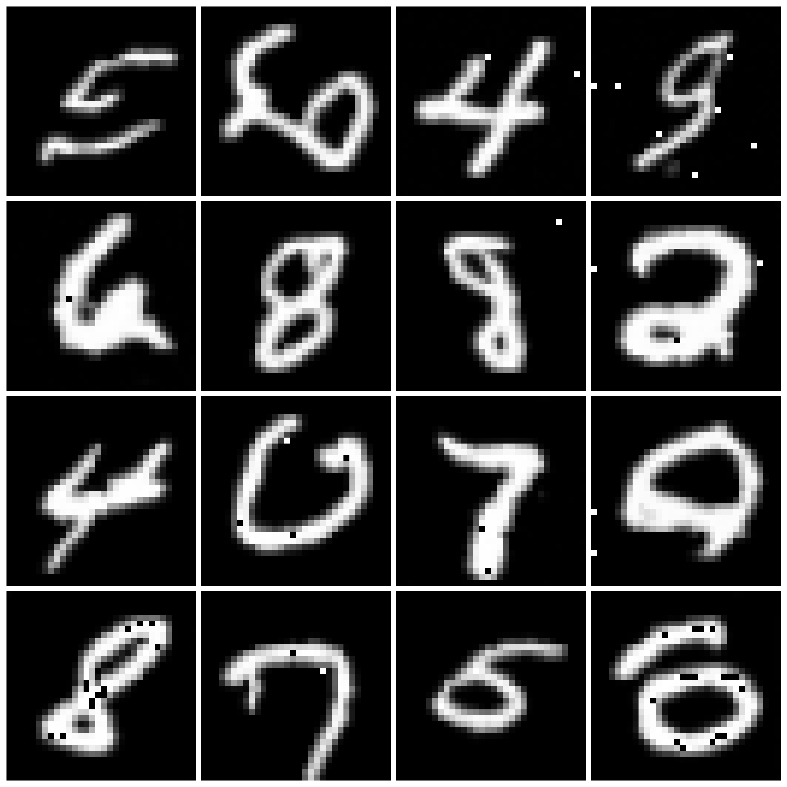

# DDPM && DDIM-Pytorch
In this project, we implemented the training and sampling of DDPM and DDIM with a focus on simplicity and readability. The code is adapted from this existing great [work](https://github.com/xiaohu2015/nngen) that implements some AIGC algorithms, which greatly helped me learn and practice the fundamental algorithms in this field. To validate the effectiveness, we only provided data loading for a few datasets available in torchvision, but of course, you can train the model on your own custom dataset.
# Training
You can easily run the following code to start training.
```sh
python .\train_process.py  
```
# Testing
After obtaining the weights through training, run the following code to test image generation.
```sh
python .\generator.py        
```

In addition to DDPM sampling, we also provide DDIM sampling. You can specify the number of sampling steps by setting the **sampling_steps**. When the number of sampling steps equals the number of training timesteps used in DDPM, the DDIM sampling degenerates into DDPM sampling.
```sh
generated_images = diffusion.ddim_fashion_sample(unet, image_size, channels, batch_size=16, sampling_steps=100)
```
# Result
Here is the result generated by uniformly sampling 50 steps with DDIM after training for 10 epochs on the MNIST dataset using 500 time steps.

# Reference
[DDPM](https://arxiv.org/pdf/2006.11239)

[DDIM](https://arxiv.org/pdf/2010.02502)
